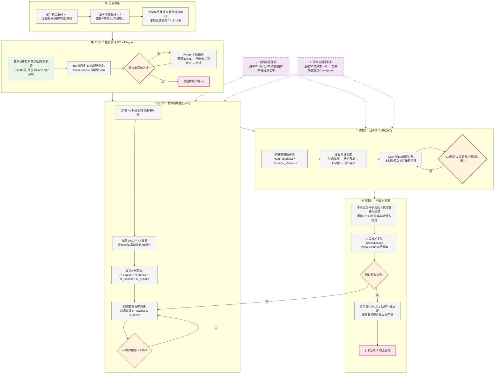

1. 学习情况了解
	1. 
2. 参数测量讲解
3. 任务安排
	1. 机器学习：文档、SAC、PPO、MCTS
	2. 参数理解和重构微调、考虑优化方案

```mermaid
flowchart TD
    classDef phase fill:#e3f2fd,stroke:#1565c0,stroke-width:2px;
    classDef process fill:#f5f5f5,stroke:#616161,stroke-width:1px;
    classDef decision fill:#fff3e0,stroke:#e65100,stroke-width:2px,shape:rhombus;
    classDef data fill:#e8f5e9,stroke:#2e7d32,stroke-width:1px,shape:parallelogram;
    classDef output fill:#fce4ec,stroke:#c2185b,stroke-width:2px,shape:stadium;
    classDef monitor fill:#f3e5f5,stroke:#6a1b9a,stroke-width:1px,stroke-dasharray: 5 5;

    subgraph Setup [🛠 前置准备]
        A1[定义状态空间 s_t\n位置/轮次/局势特征/掩码]:::process
        A2[定义动作空间 a_t\n速度v/横移Δx/角速度ω]:::process
        A3[封装仿真环境 & 教师程序接口\n支持批量查询与并行步进]:::process
        A1 --> A2 --> A3
    end

    subgraph Stage1 [📚 阶段1：模仿学习 BC + DAgger]
        B1[教师程序自对弈/对战采集轨迹\nN≥5000局, 覆盖多End/分差/布局]:::data
        B2[BC预训练: MSE损失优化\nAdam lr=1e-4, 早停验证集]:::process
        B3{验证集误差达标?}:::decision
        B4[DAgger纠偏循环:\n策略Rollout → 教师标注新状态 → 微调]:::process
        B5[输出初始策略 π₀]:::output
        B1 --> B2 --> B3
        B3 -- 否 --> B4 --> B3
        B3 -- 是 --> B5
    end

    subgraph Stage2 [🎯 阶段2：教师引导强化学习]
        C1[加载 π₀ 权重初始化策略网络]:::process
        C2[配置 SAC/PPO 算法\n连续动作/高斯策略/熵调节]:::process
        C3[设计分层奖励:\nR_sparse + R_dense + R_teacher + R_penalty]:::process
        C4[对抗教师程序训练\n动态衰减 R_teacher & R_dense]:::process
        C5{vs 教师胜率 > 65%?}:::decision
        C1 --> C2 --> C3 --> C4 --> C5
        C5 -- 否 --> C4
    end

    subgraph Stage3 [🔄 阶段3：自对弈 & 课程学习]
        D1[构建策略联赛池\nMain / Exploiter / Historical_Versions]:::process
        D2[课程渐进调度:\n冰面摩擦 → 初始布局 → End数 → 动作噪声]:::process
        D3[Main 按Elo采样对战\n定期快照入池防策略循环]:::process
        D4{Elo稳定 & 高级战术覆盖达标?}:::decision
        D1 --> D2 --> D3 --> D4
        D4 -- 否 --> D3
    end

    subgraph Stage4 [📊 阶段4：评估 & 部署]
        E1[千局固定种子测试 & 扰动鲁棒性验证\n摩擦±10%/位置噪声/教师多档位]:::process
        E2[人工战术复盘\nFreeze/Double Takeout/Guard/清营等]:::process
        E3{通过验收标准?}:::decision
        E4[模型量化/蒸馏 & 动作平滑滤波\n保留教师程序作安全回退]:::process
        E5[部署上线 & 线上监控]:::output
        E1 --> E2 --> E3
        E3 -- 否 --> C4
        E3 -- 是 --> E4 --> E5
    end

    Setup --> Stage1
    Stage1 --> Stage2
    Stage2 --> Stage3
    Stage3 --> Stage4

    F1[📈 全局监控面板\n胜率/End得分/KL散度/出界率/碰撞成功率]:::monitor
    F2[⚠️ 早停与回滚机制\n连续50次评估不升 → 加载历史最优Checkpoint]:::monitor
    F1 -.-> Stage2
    F1 -.-> Stage3
    F2 -.-> Stage2
    F2 -.-> Stage3
```