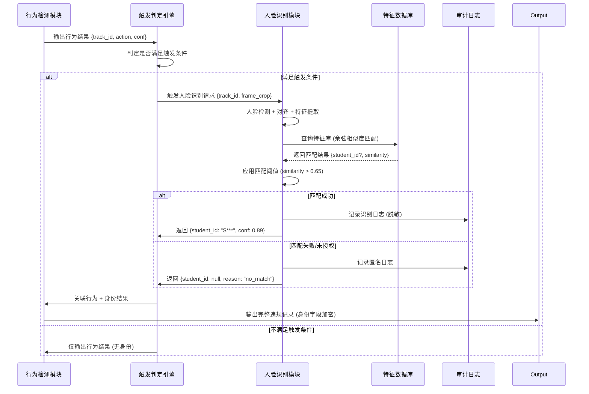

## 一、技术架构设计 (System Architecture)

### 2.1 整体架构图

```
┌─────────────────────────────────────────────────────────────────┐
│                    行为检测通道 (常开)                            │
│  ┌─────────────────────────────────────────────────────────┐   │
│  │  YOLOv8 + 时序增强 + 规则引擎                              │   │
│  │  • 实时行为分析                                          │   │
│  │  • 输出：{track_id, action, conf, duration}              │   │
│  └─────────────────────────────────────────────────────────┘   │
└─────────────────────────┬───────────────────────────────────────┘
                          ▼
┌─────────────────────────────────────────────────────────────────┐
│                 违规行为触发判定层                                │
│  ┌─────────────────────────────────────────────────────────┐   │
│  │              Violation Trigger Engine                    │   │
│  │                                                         │   │
│  │  触发条件配置 (可动态调整):                                │   │
│  │  • 行为类型: [sleeping, using_phone, ...]               │   │
│  │  • 置信度阈值: conf > 0.85                               │   │
│  │  • 持续时间: duration > 15s                              │   │
│  │  • 区域限制: 仅座位区，忽略讲台/走廊                      │   │
│  │                                                         │   │
│  │  输出: {track_id, violation_type, trigger_time}          │   │
│  └─────────────────────────────────────────────────────────┘   │
└─────────────────────────┬───────────────────────────────────────┘
                          ▼
┌─────────────────────────────────────────────────────────────────┐
│               人脸识别通道 (按需触发)                          │
│  ┌─────────────────────────────────────────────────────────┐   │
│  │  步骤 1: 人脸检测 (Face Detection)                        │   │
│  │  • 模型: YOLOv8-Face / RetinaFace-Mobile                 │   │
│  │  • 输入: 根据 track_id 定位人体框，裁剪头部区域            │   │
│  │  • 输出: 人脸框 + 5 关键点 (眼/鼻/嘴角)                    │   │
│  │                                                         │   │
│  │  步骤 2: 人脸对齐与预处理 (Alignment)                     │   │
│  │  • 基于 5 关键点仿射变换，统一为 112×112 标准尺寸          │   │
│  │  • 光照归一化 + 直方图均衡化                              │   │
│  │                                                         │   │
│  │  步骤 3: 特征提取 (Feature Embedding)                     │   │
│  │  • 模型: MobileFaceNet / ArcFace-Mobile                  │   │
│  │  • 输出: 128 维浮点特征向量 (L2 归一化)                    │   │
│  │  • 耗时: < 10ms (边缘端)                                  │   │
│  │                                                         │   │
│  │  步骤 4: 特征匹配 (Feature Matching)                      │   │
│  │  • 算法: 余弦相似度 / 欧氏距离                            │   │
│  │  • 阈值: similarity > 0.65 判定为同一人                    │   │
│  │  • 输出: {student_id, confidence, match_time}             │   │
│  └─────────────────────────────────────────────────────────┘   │
└─────────────────────────┬───────────────────────────────────────┘
                          ▼
┌─────────────────────────────────────────────────────────────────┐
│                    结果关联与输出层                               │
│  ┌─────────────────────────────────────────────────────────┐   │
│  │              Violation Record                            │   │
│  │  {                                                      │   │
│  │    "timestamp": "2024-01-15 10:23:45",                   │   │
│  │    "classroom_id": "A101",                               │   │
│  │    "track_id": 42,                                       │   │
│  │    "violation_type": "using_phone",                      │   │
│  │    "behavior_conf": 0.92,                                │   │
│  │    "duration_seconds": 18,                               │   │
│  │    "face_feature_hash": "a1b2c3...",  // 特征值哈希       │   │
│  │    "student_id": "S2024001",         // 仅授权后可见      │   │
│  │    "audit_log_id": "LOG_20240115_001"                    │   │
│  │  }                                                      │   │
│  └─────────────────────────────────────────────────────────┘   │
└─────────────────────────────────────────────────────────────────┘
```

### 2.2 关键模块技术选型

| 模块               | 推荐方案                | 备选方案          | 选型理由                                |
| ------------------ | ----------------------- | ----------------- | --------------------------------------- |
| **人脸检测** | YOLOv8-Face (n/s 版本)  | RetinaFace-Mobile | 与主检测模型同源，部署统一，速度<15ms   |
| **人脸对齐** | 5 关键点仿射变换        | 68 点 + TPS 变换  | 5 点足够课堂场景，计算量降低 80%        |
| **特征提取** | MobileFaceNet (128-dim) | ArcFace-Mobile    | 参数量<1M，边缘端推理<10ms，精度足够    |
| **特征匹配** | 余弦相似度 + 阈值判定   | FAISS 向量检索    | 课堂人数<50，线性匹配足够，无需复杂索引 |
| **特征存储** | SQLite + AES 加密       | Redis + 内存加密  | 本地轻量存储，支持权限控制与审计        |

---

## 二、核心工作流程 (Core Workflow)

### 1 时序流程图



### 3.2 伪代码实现

```python
class ViolationFaceRecognizer:
    """
    违规行为触发的人脸识别模块
    核心原则：按需触发、特征脱敏、权限控制
    """
  
    def __init__(self, config):
        # 加载轻量级人脸模型
        self.face_detector = YOLOv8Face(config.face_detect_model)
        self.face_encoder = MobileFaceNet(config.face_embed_model)
      
        # 特征库 (本地加密存储)
        self.feature_db = EncryptedFeatureDB(
            db_path=config.feature_db_path,
            key=config.aes_key
        )
      
        # 触发阈值配置
        self.trigger_config = {
            'violation_types': ['sleeping', 'using_phone'],
            'behavior_conf_threshold': 0.85,
            'duration_threshold': 15,  # 秒
            'face_match_threshold': 0.65  # 余弦相似度
        }
      
        # 审计日志
        self.audit_logger = AuditLogger(config.log_path)
  
    def should_trigger(self, behavior_result):
        """判定是否触发人脸识别"""
        if behavior_result.action not in self.trigger_config['violation_types']:
            return False
        if behavior_result.conf < self.trigger_config['behavior_conf_threshold']:
            return False
        if behavior_result.duration < self.trigger_config['duration_threshold']:
            return False
        return True
  
    def recognize(self, frame, track_id, behavior_result):
        """执行人脸识别流程"""
        # 1. 根据 track_id 定位人体框，裁剪头部区域
        head_crop = extract_head_region(frame, track_id)
        if head_crop is None:
            return {"error": "head_not_found"}
      
        # 2. 人脸检测
        face_results = self.face_detector.predict(head_crop)
        if not face_results or len(face_results) == 0:
            self.audit_logger.log(
                event="face_detect_failed",
                track_id=track_id,
                reason="no_face_detected"
            )
            return {"error": "no_face"}
      
        # 3. 人脸对齐 + 特征提取
        face_box = face_results[0].bbox
        landmarks = face_results[0].landmarks  # 5 点
        aligned_face = align_face(head_crop, landmarks)
        face_feature = self.face_encoder.extract(aligned_face)  # 128-dim
      
        # 4. 特征匹配 (余弦相似度)
        match_result = self.feature_db.search(
            query_feature=face_feature,
            threshold=self.trigger_config['face_match_threshold']
        )
      
        # 5. 结果处理与审计
        if match_result and match_result['student_id']:
            # 匹配成功 - 记录脱敏日志
            self.audit_logger.log(
                event="face_match_success",
                track_id=track_id,
                student_id_hash=hash_id(match_result['student_id']),
                similarity=match_result['similarity']
            )
            # 返回结果 (身份字段加密，需授权解密)
            return {
                "student_id_encrypted": encrypt(
                    match_result['student_id'], 
                    config.view_key
                ),
                "match_confidence": match_result['similarity'],
                "requires_authorization": True  # 标记需二次授权
            }
        else:
            # 匹配失败 - 匿名记录
            self.audit_logger.log(
                event="face_match_failed",
                track_id=track_id,
                feature_hash=hash_feature(face_feature)
            )
            return {
                "student_id": None,
                "reason": "no_match_or_unauthorized"
            }
```

---

## 四、隐私保护与权限控制 (Privacy & Access Control)

### 4.1 数据流脱敏设计

```
原始视频流
    ↓
[行为检测] → 输出: {track_id, action}  # 无身份信息
    ↓
[触发判定] → 满足条件?
    ↓ 是
[人脸裁剪] → 仅保留头部区域 (112×112)
    ↓
[特征提取] → 输出: 128 维浮点向量
    ↓
[特征匹配] → 对比本地加密特征库
    ↓
[结果输出] → 
    • 未授权用户: {violation: true, identity: "ANONYMOUS"}
    • 授权管理员: {violation: true, identity: "S2024001"} # 需解密
    ↓
[自动清理] → 识别完成后，内存中的人脸图像立即销毁
```

### 4.2 权限控制矩阵

| 角色                 | 可查看内容              | 操作权限             | 审计要求                |
| -------------------- | ----------------------- | -------------------- | ----------------------- |
| **普通教师**   | 违规行为统计 (匿名)     | 无                   | 记录查询日志            |
| **班主任**     | 本班违规行为 + 匿名身份 | 申请查看身份         | 需二次确认 + 记录原因   |
| **管理员**     | 全部数据 + 解密身份     | 导出报告、管理特征库 | 完整操作审计 + 双人复核 |
| **系统审计员** | 仅审计日志              | 无数据查看权限       | 独立日志通道            |
|                      |                         |                      |                         |

### 4.3 特征库管理

```yaml
存储设计:
  • 格式: SQLite + AES-256 加密
  • 字段:
    - student_id: 加密存储
    - feature_vector: 128-dim float32 (L2 归一化)
    - enrollment_time: 录入时间
    - expire_time: 有效期 (默认学期末)
    - last_used: 最后匹配时间
  
  安全策略:
    • 密钥管理: 使用硬件安全模块 (HSM) 或密钥管理服务
    • 访问控制: 数据库连接需双向认证
    • 备份策略: 加密备份 + 离线存储
    • 删除策略: 到期自动清除 + 手动擦除接口
```

---
