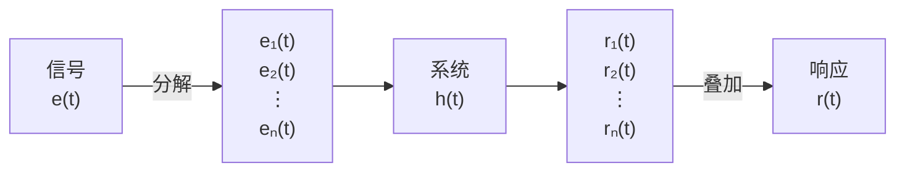

### 1. 相关概念
1. 信号跟系统的关系（图）
2. 系统
	系统的核心是输入激励和输出响应之间的关系或运算
3. 描述信号的常用方法 $\begin{cases}\text{时间函数}\\\text{波形图}\end{cases}$
4.  抽样定理是连接连续、离散信号与系统的桥梁
5. 卷积定理是连接时域分析与变换域分析的桥梁
### 2. 信号与系统的分类
1. 信号分类
	1. 确定性与随机信号（本课只讨论确定性信号）
	2. $\begin{cases}\text{连续时间信号}\\\text{离散时间信号}\end{cases}$
		连续信号（函数自变量连续） $\begin{cases}\text{幅值连续——模拟信号}\\\text{幅值离散——量化信号} \end{cases}$
		随机信号 （函数自变量离散）$\begin{cases}\text{离散抽样信号}\\\text{数字信号}\end{cases}$
	3. 周期信号与非周期信号
		周期信号：$f(t)=f(t+nT)$
	4. $\begin{cases}\text{能量信号：能量有限，平均功率趋近于0}\\\text{功率信号：功率有限，能量为无穷大}\\\text{非能量非功率}\end{cases}$
		信号能量：$E=\int^{\infty}_{-\infty}|f(t)|^2\quad dt$
		信号功率：$P=\lim_{ T \to \infty } \frac{1}{T}\int^{\frac{T}{2}}_{-\frac{T}{2}}|f(t)|^2\quad dt$
2. 系统分类
	1. $\begin{cases}\text{线性系统}\\\text{非线性系统：含有非线性元件}\end{cases}$
	2. $\begin{cases}\text{时变系统：参数随时间变化}\\\text{非时变系统}\end{cases}$
		我们主要研究线性非时变系统！
	3. $\begin{cases}\text{连续时间系统，输入输出都是连续时间信号，数学模型是微分方程}\\\text{离散时间系统：输入输出都是离散时间信号，数学模型是差分方程} \end{cases}$
		连续时间、线性、非时变系统的数学模型是常系数线性微分方程
### 3. 典型信号 ，信号与系统的基本分析过程

1. 典型信号
	1. 矩形脉冲信号——门信号
		$G_{\tau}(t)=\begin{cases}1 \quad\left( |t|<\frac{\tau}{2} \right)\\0 \quad\left( |t|> \frac{\tau}{2} \right)\end{cases}$
	2. 正弦信号
		$f(t)=A\sin(\omega t+\theta)$
		- $A$ 幅度 ，$\omega$ 角频率，$\theta$ 初始相位
	3. 指数信号
		$f(t)=Ae^{\alpha t}$
		复指数信号
			$\begin{split} f(t) =Ae^{(\sigma+j\omega)t}=Ae^{\sigma}\cos \omega t+jAe^{\sigma}\sin \omega t\end{split}$
	4. 抽样信号
		$Sa(t)=\frac{\sin t}{t}$
		- 偶函数
		- $\lim_{ t \to 0 }Sa(t)=1$
		- $Sa(n\pi)=0$
		- $\int^{\infty}_{0}Sa(t)\quad dt=\frac{\pi}{2}$
		- $\lim_{ t \to \pm\infty }Sa(t)\to{0}$
	5. 高斯信号
		$f(t)=Ee^{-(\frac{t}{\tau})^2}$
	信号与系统分析的理论基础是线性叠加原理！

2. 奇异信号
	信号本身或其导数或其积分，存在不连续点，则其各阶导数并非都是有限值
	1. 单位阶跃信号
		$u(t)=\begin{cases}0\quad t< 0\\1 \quad t\geq 0\end{cases}$
		- 单位斜坡信号（是单位阶跃信号的积分）
			$R(t)=\int^t_{-\infty}u(\tau)\quad d\tau=\begin{cases}0 \quad t< 0\\t \quad t \geq 0\end{cases}$
		- 表示矩形脉冲 $f(t)=u(t+\tau)-u(t-\tau)$
		- 表示符号函数
			$\operatorname{sgn}(t) = \begin{cases} -1 & t < 0 \\1 & t > 0 \end{cases}$
	2. 单位冲激函数
		- 定义1 ：Dirac函数
		